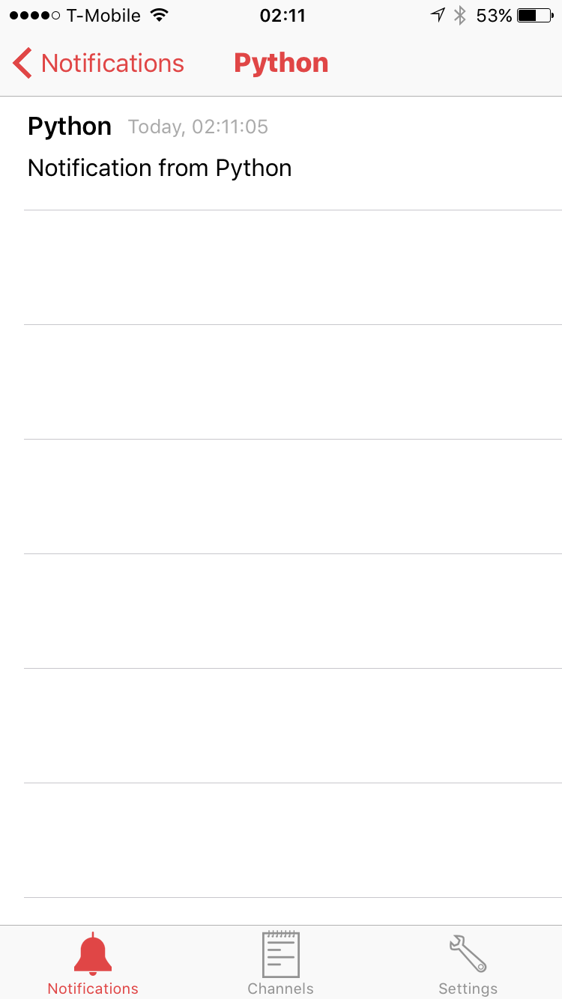

Notify Center Python SDK
=======================

An SDK to call  Notify Center API from python. 

Notify Center is the easiest way to push notifications to your iPhone from major Deep Learning frameworks...with a single line of code!

- Push notifications to iPhone from Torch, Tensorflow, Keras, etc.

- Notify Center allows you to use channels to easily separate messages of different training and testing workflows.

- Notify Center allows you to control which channel can show and store notifications. By default, notifications are on for all channels.

- All received notifications are securely stored and easily viewable anytime...anywhere.

- Notifications are encrypted in flight and at rest. Messages sent to your iPhone are only viewable by you.

- Notify Center provides  Python, Lua and Matlab SDKs so you can easily start sending notifications to your device with minimal setup or code.

- Mainly, Notify Center will allow you to redirect messages of your choice to your phone (as notifications) instead of printing them to the standard output. 

Stop waiting! We'll notify you!

Installation
------------
You can install Notify Center by using ``pip``. ::

	pip install notifycenter
	
Usage
-----
First create PUSH ID on Notify Center app then pass it to ``notify()`` with notification string. ::

	import notifycenter as nc
	mypush = '628697AB-FBB9-49C7-84AD-XXXXXXXXXXXX'
	nc.notify(mypush,'Test from Python')
	
	# Notification to multiple PUSH IDs.
	pushId2 = 'F375878F-5CB0-40E8-8F02-XXXXXXXXXXXX'
	nc.notify([pushId, pushId2], 'Notification from Torch')
	
Sample Notification
-------------------

